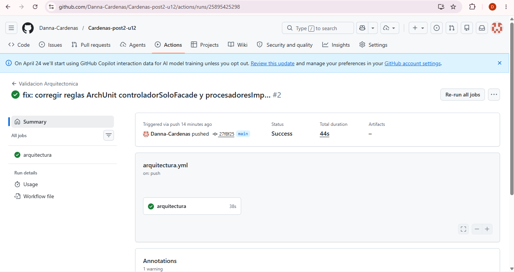
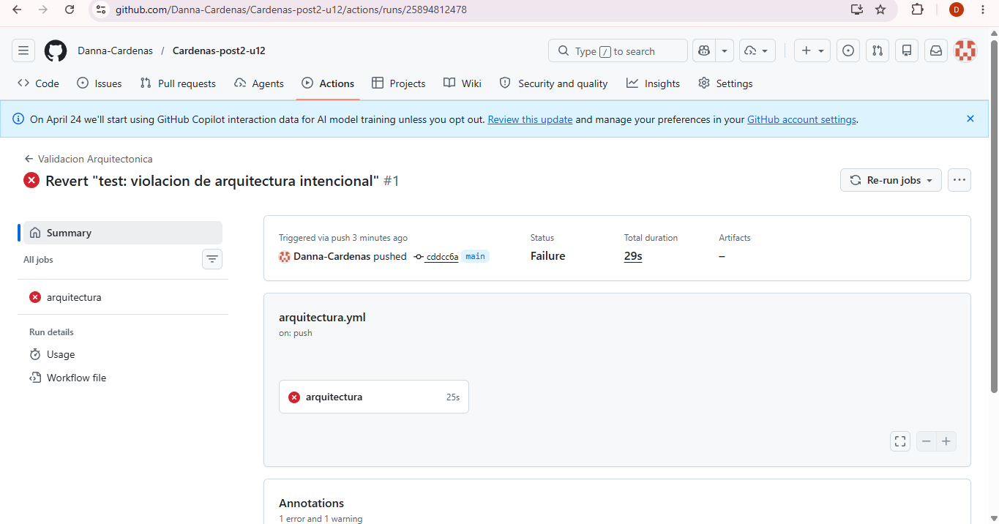

# Unidad 12: Integración de Patrones y Arquitecturas Post-Contenido 2
Juan Sebastian Gelvez Botia - 02230131065

## Validación Arquitectónica con ArchUnit y ADR

## Descripción General
 
Este proyecto extiende el sistema de gestión de pedidos del Post-Contenido 1 en dos dimensiones: primero, se codifican las reglas arquitectónicas como pruebas ArchUnit ejecutables que se verifican automáticamente en un pipeline de GitHub Actions; segundo, se documentan las tres decisiones de diseño más importantes del sistema en formato ADR.

## Validación Arquitectónica con ArchUnit
 
Se implementaron 5 reglas arquitectónicas en la clase `ReglasArquitectura` que verifican el desacoplamiento entre capas del sistema:

El estudiante implementa un conjunto de reglas de validacion arquitectonica con
ArchUnit sobre el sistema de pedidos del Post-Contenido 1, documenta tres
decisiones de diseño clave en formato ADR, y verifica que las reglas se ejecutan
automaticamente en un pipeline de GitHub Actions.

### Regla 1 — Dominio aislado
El paquete `dominio` no puede depender de `infraestructura`, `adaptadores`, JPA ni Spring Mail. Garantiza que el núcleo del negocio sea independiente de frameworks y tecnologías externas.
 
### Regla 2 — Controlador solo accede a la Facade
Las clases del paquete `adaptadores.rest` solo pueden acceder a `adaptadores.facade`, `dominio`, `org.springframework.web`, `org.springframework.http` y `java`. Evita que el controlador conozca detalles internos del sistema.
 
### Regla 3 — Puertos de dominio son interfaces
Todas las clases del paquete `dominio.puertos` deben ser interfaces. Garantiza que los puertos sean contratos abstractos y no implementaciones concretas.
 
### Regla 4 — Procesadores implementan el puerto
Las clases del paquete `adaptadores.procesadores` (excluyendo Factory y Tests) deben implementar `ProcesadorPedido`. Asegura que todos los procesadores cumplan el contrato definido por el dominio.
 
### Regla 5 — Infraestructura no accede a adaptadores REST
Las clases de `infraestructura` no pueden acceder a `adaptadores.rest`. Previene dependencias circulares entre capas.

## ADRs
- docs/adr/ADR-001.md
- docs/adr/ADR-002.md
- docs/adr/ADR-003.md

## Pipeline GitHub Actions
 
El workflow `arquitectura.yml` ejecuta las 5 reglas ArchUnit automáticamente en cada push a `main` o `develop`.
 
### Pipeline verde — todas las reglas pasan 

 
### Pipeline rojo — violación de arquitectura detectada 

